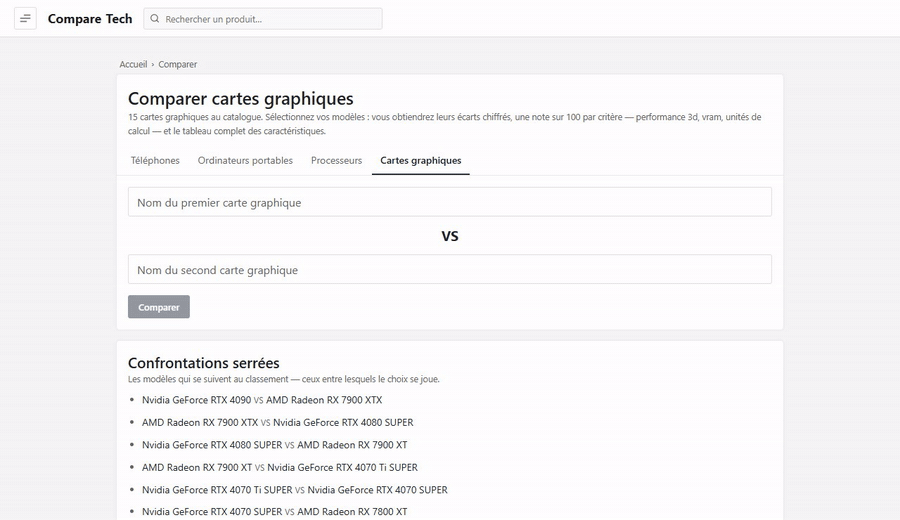

# COMPARE-TECH

Comparateur d'appareils technologiques (CPU, GPU, portables, téléphones) avec **verdict généré par IA**.

Monorepo réunissant le backend et le frontend dans un seul dépôt, avec l'historique Git complet des deux projets.

## En ligne

- **Frontend** — https://compare-tech-theta.vercel.app
- **API backend** — https://mahamoud-compare-tech-api.onrender.com

## Aperçu

**Parcourir** — accueil, catégories notées, puis le classement complet d'une famille de produits.


**Comparer** — deux modèles désignés à la saisie, leurs écarts chiffrés, les notes par critère et le radar de profil.



**Chercher** — recherche instantanée sur tout le catalogue, fiche produit, thème sombre.


## Structure

```
COMPARE-TECH/
├── backend/    → API REST (Node.js · Express · MongoDB · JWT · Gemini)
├── frontend/   → Interface web (React · Vite)
└── docs/       → GIF de démonstration et script qui les enregistre
```

## Backend

```bash
cd backend
npm install
cp .env.example .env   # renseigner DB_URI, ADMIN_PASSWORD, JWT_SECRET, GEMINI_API_KEY
npm start              # http://localhost:3001
```

Routes principales : `GET /api/cpus`, `/api/gpus`, `/api/laptops`, `/api/telephones`, `/api/featured`, `POST /api/ai/verdict`, `POST /api/auth/login`.

## Frontend

```bash
cd frontend
npm install
npm run dev            # http://localhost:5173
npm test               # logique de comparaison (node --test, sans dépendance)
```

Le frontend pointe vers l'API via la variable `VITE_API_BASE` (par défaut : l'API déployée sur Render).

### Interface

Aucun framework CSS : `src/index.css` est la seule feuille de style, organisée
en un système de classes `.nr-*` (cartes, barres de score, tableaux comparatifs,
listes classées). Les couleurs passent toutes par des variables `--nr-*`
redéfinies sous `[data-theme="dark"]` — une couleur écrite en dur dans une règle
de composant casserait le thème sombre.

Trois fichiers concentrent la connaissance métier, et toute page qui affiche des
caractéristiques doit s'y référer plutôt que redéclarer sa propre liste :

| Fichier | Rôle |
| --- | --- |
| `src/utils/specs.js` | Caractéristiques affichables par catégorie, benchmarks, calcul des différences clés |
| `src/utils/scores.js` | Formules du score sur 100 et son échelle de couleur |
| `src/utils/radarAxes.js` | Axes du radar et notes par critère |

Le radar est tracé en SVG par `src/components/TechRadar.jsx`, sans bibliothèque
de graphiques. Les collections sont mises en cache une minute par
`src/utils/catalog.js`, partagé entre la recherche de l'en-tête et les pages :
c'est ce qui évite qu'une même liste soit demandée deux fois par écran.

## Déploiement

- **Frontend** → Vercel : https://compare-tech-theta.vercel.app (`frontend/vercel.json`, root `frontend/`)
- **Backend** → Render : https://mahamoud-compare-tech-api.onrender.com (`backend/render.yaml`, root `backend/`)

## Auteur

Mahamoud Diabaté — [github.com/mahamoud-diabate](https://github.com/mahamoud-diabate)
